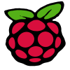

<!--
# WHYELAB_GitHubProfile
-->

## About Me
Hey there! 👋 I'm a Computer Engineering student at NUS with a passion for Software Engineering, Web/Mobile Development, and Artificial Intelligence. I love to learn through project-based experimentation and believe the most important aspect of any project is to have fun! When I'm not working on projects, I'm exploring new technologies, attending hackathons, and collaborating with others to build innovative solutions. Overall, I'm a curious and enthusiastic individual who is eager to take on new challenges and grow my tech skills.

## Dashboard

  <a href="https://github.com/YEOWEIHNGWHYELAB">
  
  

 

## My Favourite Operating System 

## View Counter

